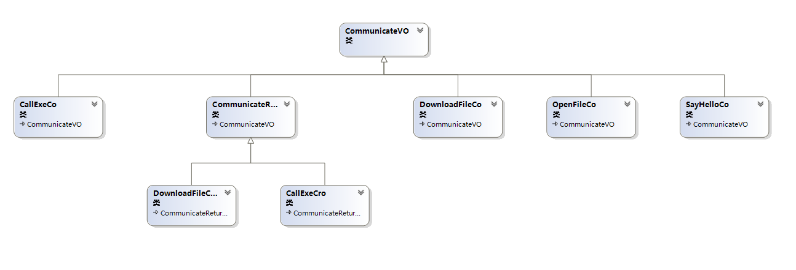
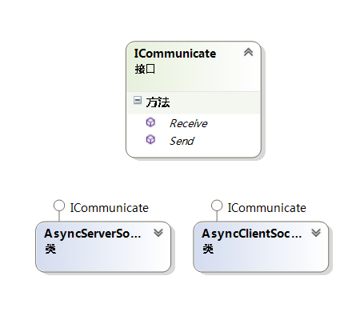

# 本机服务概述

NativeServer 是一个Socket本机服务。新版HTML5支持WebSocket，因此以往采用C/S架构要做一些本机API的事情，可以用 B/S + 本机服务方式替代。

## 工程目录说明
```JS
├─app                       // 程序服务目录
├─bin
├─exception                 // 系统异常目录
├─handler                   // 异步函数声明目录
├─obj
├─Properties
└─socket                   // socket 核心
    ├─co                   // Communivate VO
    │  └─cro               // Communivate return VO
    ├─constant            //  常量
    └─utils               //  工具库
```

## 类图说明

- 通讯VO类图

通讯VO分为两类：CommunicateVo（简写:co） 和 CommunicateReturnVO（简写：cro）。CommunicateVO 是客户端发起服务调用通讯VO，CommunicateReturnVO是服务相应对应的通讯VO。



- Socket 接口

Sokcet 服务常规会有两个接口：Receive 和 Send。AsyncClientSocket 和 AysncServerSocket 都实现这两个接口，从而实现接收和发送双向通讯。



- CMType 枚举

CMType 枚举规定了NativeServer对外提供的服务类型。默认情况下有以下几种服务：

```Csharp
public enum CMType
{
    SayHello = 0,    // 握手服务，无实际意义。
    CallExe = 1,     // 调用exe
    DownloadFile = 2, //下载文件
    OpenFile = 3,  // 打开文件
}
```

所有对外的服务必须在此处声明注册。


## 新增服务

- 在 CMType 中注册服务类型
- 定义服务调用CO，并继承 CommunicateVO
- 如果存在响应：定义响应通讯CRO,并继承 CommunicateReturnVo
- 在 app 目录下开发服务类
- 在SocketForm中的Receive函数增加逻辑判断，并增加相关处理函数，函数名要求：deal开头
- 如果存在异步响应，需要声明托管函数，托管函数统一在handler目录下的DelegateHandler中声明
